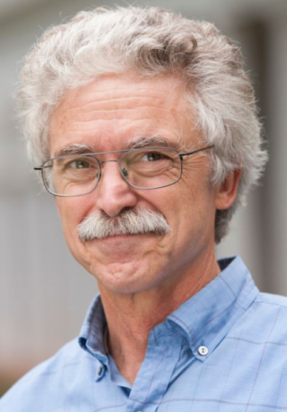

     

       

 <h2>Team Members</h2>
 

   

   <h4>Bill Shobe, Ph.D.</h4>
   
<i>Director; Professor  <a href="https://ceps.coopercenter.org/profile/william-shobe">Cooper Center webpage</a> </i>

   
 Ph.D., Economics, University of Minnesota 
 J.D., Lewis and Clark School  
 B.A., Political Science, Vanderbilt University

   
 Professor Shobe is the director of the VA Clean Energy Project, and the director of the Center for Economic and Policy Studies at the UVA Weldon Cooper Center for Public Service. His current research includes emission market and auction design, environmental federalism, improved economic modeling of Virginia’s economy, state economic development incentives, and state economic forecasting.

 

 

   

   <h4>Arthur Small, Ph.D.</h4>
   
<i>Senior Research Scientist; Team Lead, Data Science  <a href="https://ceps.coopercenter.org/node/494006">Cooper Center webpage</a> </i>

   
 Ph.D., Agricultural and Resource Economics, University of California at Berkeley  
 M.S., Mathematics, Cornell University  
 A.B., Mathematics, Columbia University 

   
Professor Small directs the Data & Analytics research team for the VA Clean Energy Project. He is a Senior Research Scientist at the University of Virginia's Weldon Cooper Center for Public Service, working as an economist and decision scientist specializing in issues of energy, climate, and environment. 

 

 

   

   <h4>Anthony Artuso, Ph.D.</h4>
   
<i>Visiting Scholar; Team Lead, Policy Analysis   <a href="https://ceps.coopercenter.org/profile/anthony-artuso">Cooper Center webpage</a> </i>

   
 Ph.D., Natural Resource Policy & Management, Cornell University 
 M.S., City and Regional Planning, Kennedy School of Government at Harvard University  
 B.S., Environmental Science, Columbia University 

   
Dr. Artuso directs the Policy Research team for the VA Clean Energy Project. He is a Visiting Scholar at the University of Virginia's Weldon Cooper Center for Public Service. 

 

  

  <h4>Elizabeth Marshall</h4>
  
<i>Senior Project Coordinator  <a href="https://ceps.coopercenter.org/node/493326">Cooper Center Webpage</a></i>

  
 Design Thinking and Innovation Specialization, University of Virginia Darden School of Business 
B.A., Urban and Environmental Planning, University of Virginia 

  
 Elizabeth coordinates the Virginia Solar Initiative for the Weldon Cooper Center. Immediately prior to this appointment she managed projects for Organizational Excellence, UVA’s pan-institutional quality and improvement program, and she has served as an urban planner in both the private and public sectors. She graduated from University of Virginia School of Architecture with a degree in Urban and Environmental Planning and holds a specialization in Design Thinking and Innovation from Darden Graduate School of Business.  

 

   

   <h4>Roger Zhu</h4>
   
<i>Doctoral Researcher  <a href="https://www.linkedin.com/in/rogerzhuuva/">LinkedIn</a></i>

   
 Ph.D., Mechanical Engineering, University of Virginia 
 B.S., Mechanical Engineering, University of Virginia  
 B.A., Financial Mathematics, University of Virginia

   
 Roger is a member of the Data Science team as well as the Policy Research team. He focuses mainly on the team research project for energy systems modeling, involving Temoa implementation for Virginia.  

 

 

 

 

   

   <h4>Richard Liu</h4>
   
<i>Graduate Research Intern  <a href="">LinkedIn</a></i>

   
 M.S., Systems Engineering, University of Virginia   
       B.S., Management Information Systems, Wuhan University  

   
 Richard works with the Data Science team as well as the Policy Research team. His main focus is currently on the smart power contracting project, which is an integrated system intended to allow more efficient interaction between electricity prosumers and consumers. His research interests include data analytics and system design.  

 

 

 <h4>Stephen Leff</h4>
 
<i>Policy Analysis Team Member at Darden School of Business  <a href="https://www.linkedin.com/in/stephenleff/">LinkedIn</a></i>

 
 Global Executive MBA Candidate, Darden School of Business, University of Virginia  
   MSE, Industrial and Systems Engineering, University of Washington  
     BSE, Industrial and Operations Engineering, University of Michigan  

 
 Stephen is a member of the Policy Research team. He works as a Senior Systems Engineer for BWX Technologies  

 

   

   <h4>Alex Watkins</h4>
   
<i>Graduate Assistant at the Weldon Cooper Center for Public Service  </i>

   
 M.S. Civil Engineering, University of Tehran, Iran  
 B.S. Civil Engineering, Sharif University, Iran 

   
Alex is a member of the Data Science team. He is currently working on a report on how Virginia can best take advantage of a smarter grid to complete its transition to zero carbon emissions. The report also includes research on current smart grid use as well as Dominion's current plans on smart grid use. 

 

 

   

   <h4>David Hill</h4>
   
<i>Graduate Research Software Developer  <a href="https://www.linkedin.com/in/david-hill-jr-b22b96127">LinkedIn</a></i>

   
 M.E., Systems Engineering, University of Virginia  
       B.S., Computer Science, Howard University   

 David is a Civilian Software Engineer for the Dept. of Defense and a member of the Data Science team. He is using his experience to strengthen the team's efforts in implementing Python tools for energy model optimization and analysis (TEMOA). His goal is to advance clean energy research to improve Virginia's economy. 

 

 

  <h4>Emily Weidenfeller</h4>
  
<i>Graduate Research Intern  <a href="">LinkedIn</a></i>

      
 B.S., Aerospace Engineering, University of Colorado at Boulder 

  
 Emily is a member of the Data Science team and publications process. She works on data management as well as the Virginia Electricity Almanac. 

 

  

    

    <h4>Ethan Novak</h4>
    
<i>Undergraduate Research Assistant  <a href="">LinkedIn</a></i>

    
 Ethan works with the Data Science team as well as the Policy Research team. He contributes to team cloud services as well as team dashboards. He also works on energy systems modeling. 

  

    

    <h4>Brian Lee</h4>
    
<i>Undergraduate Research Assistant  <a href="https://www.linkedin.com/in/brian-lee-904403117/">LinkedIn</a></i>

    
 B.A., Economics, University of Virginia 

    
 Brian is a member of the Data Science team. He collects datasets in order to be used within the team database. He also helps to organize and clean datasets, as well as to write scripts to pull needed information. 

  

  

    

    <h4>Jaden Stanford</h4>
    
<i>Undergraduate Research Assistant  <a href="https://www.linkedin.com/in/jaden-s-190443129/">LinkedIn</a></i>

    
 B.S. Biomedical Engineering, University of Virginia 

    
 Jaden is a member of the Data Science team. She works primarily on the publications process in constructing and updating the code on GitHub for the VA Clean Energy team website. 

  

  

  

  

    

    <h4>Elinor Frothingham</h4>
    
<i>Undergraduate Research Assistant  <a href="https://www.linkedin.com/in/elinorfrothingham/">LinkedIn</a></i>

        
 B.S., Commerce, University of Virginia 

    
 Elinor is a member of the Data Science team and a part of the publications project. She is responsible for telling the story of the VA Clean Energy Project through content creation and manages the sharing of content with the UVA Weldon Cooper Center for Public Service and other outlets. 

  

  

    

    <h4>Hannah Boyles</h4>
    
<i>Undergraduate Research Assistant  <a href="">LinkedIn</a></i>

    
 B.S., Aerospace Engineering, University of Virginia 

    
 Hannah works mainly with the Policy Research team. She is currently working on state summaries of renewable energy policies, as well as a summary for the U.K in order to gain insight for the team on international energy policies. She also contributes to team research and reports on energy equity. 

  

  

  

    

    <h4>Chloe Fauvel</h4>
    
<i>Undergraduate Research Assistant  <a href="">LinkedIn</a></i>

    
 B.S., Systems Engineering, University of Virginia 

    
 Chloe is a member of the Data Science team. She currently acts as the team database administrator, making sure data tables and github code writing to the database is clean and consistent. She will also oversee geospatial data addition to the database.

  

  

    

    <h4>Charles Groscup</h4>
    
<i>Undergraduate Intern at Center for Economic and Policy Studies  <a href="">LinkedIn</a></i>

      
 B.S., Economics, University of Virginia 

    
 Charles is a member of the Policy Research team. He is currently working on compiling state summaries regarding different clean energy policies and initiatives for the State Energy Dashboard. 

  

<h2 id="alumni">Alumni</h2>
 

  

  <h4>Daniel Aycock</h4>
  
<i>Associate, CustomerFirst Renewables  <a href="https://www.linkedin.com/in/danielaycock/">LinkedIn</a></i>

  
 MBA, Darden School of Business, University of Virginia  
Master of Accountancy, University of Tennessee 
B.S., Business Administration, University of Tennessee

  
 Daniel worked with the Policy Research team during his time with the VA Clean Energy Project. He served as a lead author on a report reviewing the viability of an array of clean dispatchable generation and long-duration storage technologies to enable Virginia’s future 100% clean electricity system. After graduating from Darden, Daniel now lives in the Washington, DC area, where he is joining CustomerFirst Renewables (CFR), a leading clean energy consulting firm advising organizations seeking to access more renewable power. 

  

  <h4>Tyler Lohmeyer</h4>
  
<i>Associate Utilities Analyst at the Virginia SCC  <a href="https://www.linkedin.com/in/tyler-lohmeyer-7a2a26147/">LinkedIn</a></i>

  
 B.A., Economics, University of Virginia  
	B.A., Global Studies - Environments and Sustainability, University of Virginia

  
 Tyler was an undergraduate research assistant during his time with the VA Clean Energy Project, working with the Policy Research team on regulatory innovation. He now works as an Associate Utilitis Analyst at the Virginia State Corporation Commission (SCC). 

 

  

  <h4>Jackson Brandberg</h4>
  
<i>Undergraduate Research Assistant  <a href="https://www.linkedin.com/in/jackson-brandberg-aaab1613b/">LinkedIn</a></i>

  
 B.A., Global/International Studies, University of Virginia 

  
Jackson was a member of the Data Science team during his time with the Virginia Clean Energy Project. He worked on the team dashboards, team data management, and geospatial data projects. 

    

  

    

    <h4>Christina Zhong</h4>
    
<i>Undergraduate Research Assistant  <a href="">LinkedIn</a></i>

    
Christina was a member of the Data Science team during her time on the Virginia Clean Energy Project. She contributed to the team dashboards, as well as data management and geospatial data projects. 

    

  

  

  

  <h4>Caleb Neale</h4>
  
<i>Undergraduate Research Assistant  <a href="https://www.linkedin.com/in/calebneale/">LinkedIn</a></i>

  
 B.S., Systems & Information Engineering, University of Virginia 

  
 Caleb was a member of the Data Science team while he worked with the Virginia Clean Energy Project . He worked primarily on managing and maintaining the team dashboards.  

  

  <h4>Neha Awasthi</h4>
  
<i>Undergraduate Research Assistant  <a href="">LinkedIn</a></i>

  
 B.S., Civil and Environmental Engineering, University of Virginia 

  
 Neha was a member of the Data Science team. She worked primarily on tasks in data visualization for parts of the team project, as well as on the states dashboard project.  

     

   

   

     

       

       <h4>Jamison Stevens</h4>
       
<i>Undergraduate Research Assistant  <a href="https://www.linkedin.com/in/jamisonstevens/">LinkedIn</a></i>

         
 B.S, Electrical Engineering, University of Virginia  
             B.A, Economics, University of Virginia   

       
 Jamison was a member of the Data Science team and Policy Research team. He worked on data and analytics, the publications process, and community solar policy. 

     

     

       

       <h4>Alexis Freitas</h4>
       
<i>Undergraduate Research Assistant  <a href="">LinkedIn</a></i>

       
 Alexis was a member of the Data Science team. She worked primarily on the team dashboards and data visualization projects. 

     

   

   

   

     

     <h4>Lauren Coppins</h4>
     
<i>Undergraduate Research Assistant  <a href="https://www.linkedin.com/in/lauren-coppins-045857195/">LinkedIn</a></i>

                 
 B.S., Commerce, University of Virginia 

     
 Lauren was a member of the Data Science team. She worked primarily on data visualization projects for the various team dashboards. 

     

     

    

    <h4>Alexander Gellerstedt</h4>
    
<i>Graduate Intern at Batten School  <a href="https://www.linkedin.com/in/alexander-gellerstedt-465997166/?trk=public_profile_browsemap_profile-result-card_result-card_full-click">LinkedIn</a></i>

    
 M.P.P., Public Policy Analysis, University of Virginia  
       B.S., Economics, Business, University of Virginia  

    
 Alexander was a member of the Policy Research team. He contributed mainly to state summaries of clean energy practices for team reports. 

    

   

   

     

       

       <h4>David Brenman</h4>
       
<i>Undergraduate Research Assistant  <a href="https://www.linkedin.com/in/david-brenman/">LinkedIn</a></i>

               
 B.S., Systems Engineering, University of Virginia  
   	  B.A., Economics, University of Virginia

       
 David worked with the Data Science and Policy Research team. He researched Virginia's power grid and conducted analysis on its transmission & distribution system. He also helped pull data from the team database.  

     

     

       

       <h4>Aishvarya Pathange</h4>
       
<i>Undergraduate Research Assistant  <a href="https://www.linkedin.com/in/aishvarya-pathange/">LinkedIn</a></i>

       
 B.S., Economics, University of Virginia  
   B.A., Psychology, University of Virginia

       
 Aishvarya was a member of the Data Science team, working mainly on data visualization projects. She also worked to create various graphics for capacity factor data for team dashboards.

   

   

   

     

       

       <h4>Harrison Snell</h4>
   	  
<i>Undergraduate Research Assistant  <a href="https://www.linkedin.com/in/harrison-snell-324a23187/">LinkedIn</a></i>

         
 B.A., Economics, University of Virginia  
   	  B.A., Mathematics, University of Virginia

       
Harrison was a member of the Policy Research team. He worked on compiling summaries of legislation and policies for other clean energy states. He also researched Virginia's transmission grid to explore how it would need to be modified to meet the demands of renewable energy production. 

       

       

         

         <h4>Mai Luu</h4>
         
<i>Undergraduate Research Assistant  <a href="">LinkedIn</a></i>

         
 B.S., Systems Engineering, University of Virginia  
             A.S., Engineering, Northern Virginia Community College  

         
 Mai was a member of the Data Science team. She mainly contributed to team data management projects. 

       

       

       

         

         <h4>Sarah Benda</h4>
         
<i>Undergraduate Research Assistant  <a href="">LinkedIn</a></i>

         
 B.S., Economics and Global Sustainability, University of Virginia 

         
 Sarah was a member of the Policy Research team.  She worked on a report analyzing the soft costs of distributed solar power as well as identifying the best practices for soft cost reduction. 

         

         

           

           <h4>Allison Feeney</h4>
           
<i>Undergraduate Research Intern  <a href="https://www.linkedin.com/in/mary-allison-feeney/ ">LinkedIn</a></i>

           
 B.S., Chemical Engineering, University of Virginia 

               
 Allison was a member of the Policy Research team. She contributed to the state summary projects and also researched energy storage policies. 

          

          

